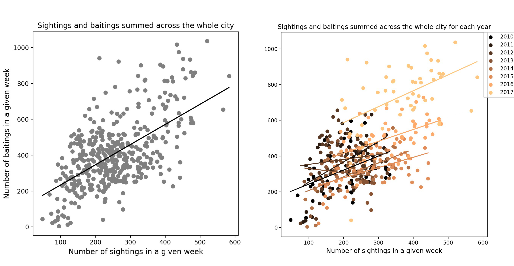
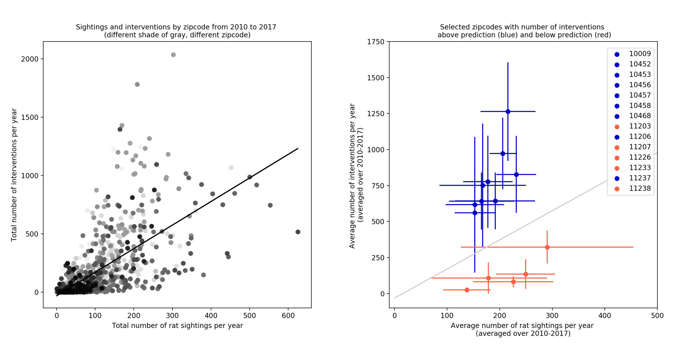
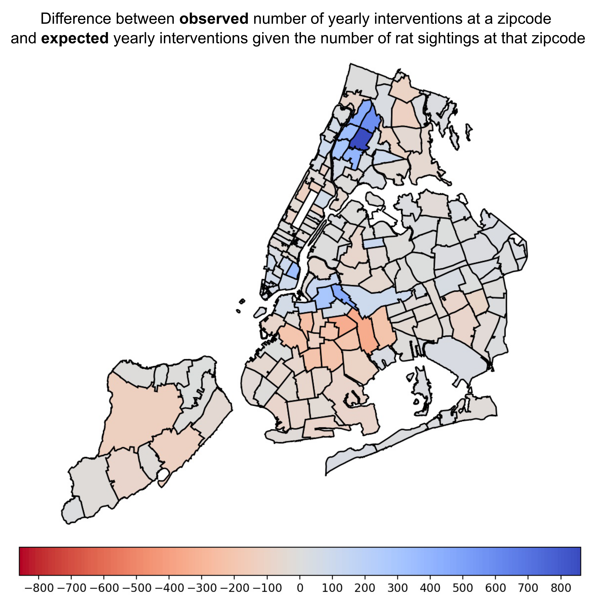

<H3>NYC Rat Sightings Project </H3>
 

Rats are a large problem in New York City. They present a health threat, can contaminate food, spread diseases and reduce quality of life. They can also damage utilities and contribute to the erosion of buildings’ structural integrity. In the last years the rat population in the city increased as New Yorkers logged more than 17,200 sightings in 2016, up from 12,600 in 2014. In an attempt to reduce the number of NYC rats mayor Bill de Blasio just last year declared to dedicate <a href="https://www.nytimes.com/2017/07/12/nyregion/new-york-city-rat-problem.html">$32 million </a> to fight the most problematic rat areas in the city.  
 
 
In my project I am exploring rat sightings across New York City reported via the 311 system. I have a dataset that contains reported rat sightings since 2010 until today (in total around 110 000 logged events) and a dataset that contains rodent interventions/inspections in the city, also since 2010 until today (in total around 1.3 million logged events). This totals to <b>around 380MB of data</b>. Both datasets (among other things) contain locations of a sighting or intervention, time of event and type.    
I am interested in exploring and understanding the dynamics of rat sightings across time and how they couple to intervention events. The ultimate goal of my project is: 
<b>(i)</b> to asses the effect of rat interventions, in particular the effect of increased interventions since 2017 
<b>(ii)</b> choose and test different models for this system (simple linear regression, k-Nearest Neighbors, Random Forest)  
<b>(iii)</b> make predictions and inform how best to distribute future interventions 
If needed I also plan to include weather data, socioeconomic data on individual NYC neighborhoods and if obtainable a New York City Department of Sanitation schedule or log of garbage collections, all of which I expect will improve my model.
  

So far I extracted intervention events where rodenticide was applied and rat sighting events and I created a spatio-temporal animation of these two as seen in the gif below. Each point in the animation corresponds to a rat sighting (in crimson) or a baiting intervention event (in aqua). The animation displays that while rat sightings occur across the city, they are distributed very non-uniformly. It also shows rich dynamics with oscillatory behavior and an overall increase of the number of events over the years.

That is even more visible in the two plots below - the top plot shows the number of rat sightings and interventions per month as a function of time and clearly demonstrates that the number of rat sighting (in crimson) oscillates and on average increases as does the number of interventions (in aqua) which shows a noticeable increase starting in 2016. The bottom plot shows the average number of rat sightings and interventions per week for a given year. I look at weekly number of rat sightings in years 2010-2013 and compare them using a one-way ANOVA.

The obtained p-value equals 0.9642 as is denoted on the bottom plot. From 2013 on I compare weekly number of rat sightings in each year with the year prior by using a two-sample t-tests. The p-values denoted in the bottom plot show that the increase of rat sightings per week in 2014 compared to 2013 is statistically significant.  
 <b> Conclusion I: From 2013 on, the difference in the number of rat sightings in a given year compared to the year prior is statistically significant.</b>  
As the average number of rat sightings per week has increased, the average number of rat baitings has increased as well, but only starting in 2016 when there were on average 51% more weekly baitings than the year before and in 2017 when there were 47% more baiting interventions per week than the year before. 
I then compared the slope of rat sightings increase bewteen consecutive years after 2013 and the results show that the slope does not change from one year to the next (slope = 41.3 std err = 3.6), from which I can conclude that from 2013 on the rate of growth has been constant. Which is not exponential growth in which case the increase in numbers is proportional to the population size so the rate of change is not constant. Exponential growth has fixed percent increase at regular time intervals. Here is what I can conclude so far: 
The number of rat sightings began to increase in 2014 and in 2016 the City ramped up the number of rat interventions. What followed was that instead of observing the rate of growth of rat sightings curve up in the years after the number of rat sightings started growing, the growth rate remains constant. So this could be a consequence of the City coming up with more interventions, this "arrested" growth does coincide with a large increase of interventions. But it could also have to do with other factors of course, like saturation of natural habitat, etc. 
  
Now I want to explore the City's strategy a bit, how they distribute interventions in time and space. I will first check how the number of weekly baiting interventions is related to the number of weekly rat sightings when summed across the whole city. Does the City respond to a week with more rat sightings with more baiting interventions that week?

The City does respond to more weekly rat sightings in a week with more baiting interventions in that week. Linear regression results suggest that when looking over the whole time span 2010-2018, the City's strategy has been that for every 100 additional rat sightings in a week, there are on average between 98 and 127 additional rat baiting interventions that week. And from the intercept estimate we can conclude that in absence of any rat sightings, the number of weekly baiting interventions would be on average somewhere between 81 and 161. The plot on th eright gets at the question how (or if) this strategy has changed over the years, in particular since 2016 when there has been a noticable increase in rat bating interventions. I will use ANCOVA (analysis of covariance), it is basically a statistical comparison of regression lines, to test if the strategy by the City has changed in the last two years - are the slopes equal if I compare 2014, 2015, 2016, 2017? My test shows that all estimated slopes for different years are the same, they are not significantly different from one another (from year 2010). So the city did not change the rate at which it increases the number of responses in a week as the number of sightings in that week increases. Now I can check if the estimated intercepts have changed since 2015 (by eye it looks like 2016 and 2017 are different from its previous years). So I see that a change in intercept was not significant in 2015 but there is a significant change in the estimated intercept in 2016 and again in 2017. This means that starting in 2016 not only is the City responding with more baiting interventions as there are more rat sightings, but that the 'strategy' has changed in 2016 and again in 2017  - the linear line fit has moved up in 2016 and again in 2017, the estimated intercept of linear regression increased in 2016 and then it further increased in 2017. So while the City has increased the overall baseline response (the intercept increased in 2016 and in 2017) and it continues to respond to more sightings with more interventions (linear fit is good in 2016 and 2017), the City did not also change the rate at which it increases the number of responses in a week if the number of sightings in that week increases. 
 
Now I want to check how the City distributes these interventions across different neighborhoods. I saw that when there are more rat sightings in a week, there are more rat interventions that week. And when there are more rat sightings in a given week, there are more interventions the week after. Is that also true if I look at it by zipcode - so is it the case that there are more interventions in the neighbourhoods where there are more sightings?

The plot on the left and linear regression model shows that the yearly total number of rat sightings for a given zipcode is correlated to the yearly total number of rat interventions at that zipcode (R^2 = 0.44) and the relation is significant (p-values 0.0000). This is also true if I look at total sightings/interventions per month or per week, but the deviations are much larger in those cases so the fit is worse, but still significant. So it is indeed the case that on average there are more interventions at locations where there are more rat sightings. (Just a note on this reasoning: once could also flip it and say there are more rat sightings where there are more interventions. Both are independent of one another in both ways no? So all I can say is that there is a correlation) On average in the period 2010-2017 a neighborhood "needs" at least around 7 rat sightings per year to start getting interventions. And on average in this time period a neighborhood with additional 100 rat sightings per year, has beween 189 and 215 additional interventions per year. One thing I notice because I plotted each zipcode with a different shade is that some zipcodes seem to separate into different clusters. A couple zipcodes are consistently above the regression line and a couple are consistently below. The plot on the right shows such zipcodes that deviate most from the linear fit.
  
One extreme difference I can point out is the difference between a couple Bronx zip codes (10456, 10457, 10458, 10468) - around Fordham University that have on average between 327 and 795 MORE rat interventions per year than predicted. On the other all the zipcodes with far fewer interventions than predicted are Brooklyn zip codes (11238,11233,11207,...) - part of Crown Heights, Bed-Stuy, South-East Brooklyn... that have on average up to 400 FEWER rat interventions per year than predicted. In many of these Bronx and Brooklyn neighborhoods the numbers of rat sightings are comparable if not even indistinguishable, yet the number of interventions are on average at least 7 times higher in the Bronx zipcodes. 
I also did an ANOVA on a couple of these and showed that between some there are no sigificant differences in number of sightings but there are siginificant diferences in the number of interventions. 
And here is a plot where each zipcode is colored according to how much the number of interventions deviates from the linear fit prediction based on the number of rat sightings at that zipcode. 

It will be interesting to further investigate in what ways these neighborhoods are different to try to see if I can find any possible indication of what impact such a different level of interventions has.     
Rat sightings dataset is found here: <a href="https://nycopendata.socrata.com/Social-Services/Rat-Sightings/3q43-55fe/data">Rat sightings</a> 
 

Rodent interventions/inspections dataset is found here: <a href="https://data.cityofnewyork.us/Health/Rodent-Inspection/p937-wjvj">Rodent interventions</a> 
