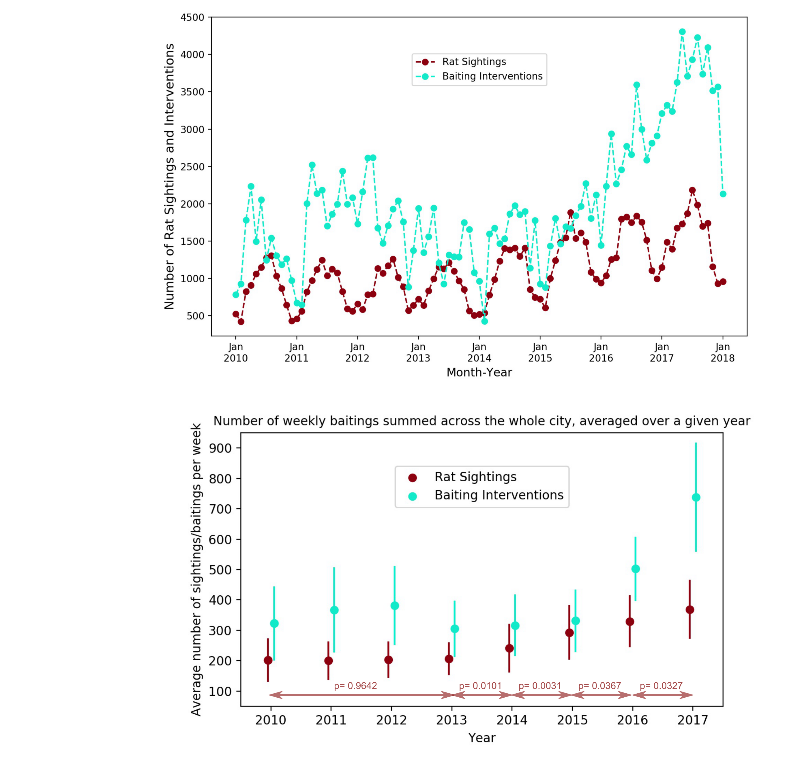

<H3>NYC Rat Sightings Project </H3>
 

Rats are a large problem in New York City. They present a health threat, can contaminate food, spread diseases and reduce quality of life. They can also damage utilities and contribute to the erosion of buildings’ structural integrity. In the last years the rat population in the city increased as New Yorkers logged more than 17,200 sightings in 2016, up from 12,600 in 2014. In an attempt to reduce the number of NYC rats mayor Bill de Blasio just last year declared to dedicate <a href="https://www.nytimes.com/2017/07/12/nyregion/new-york-city-rat-problem.html">$32 million </a> to fight the most problematic rat areas in the city.  
 
 
In my project I am exploring rat sightings across New York City reported via the 311 system. I have a dataset that contains reported rat sightings since 2010 until today (in total around 110 000 logged events) and a dataset that contains rodent interventions/inspections in the city, also since 2010 until today (in total around 1.3 million logged events). This totals to around 380MB of data. Both datasets (among other things) contain locations of a sighting or intervention, time of event and type.    
I am interested in exploring and understanding the dynamics of rat sightings across time and how they couple to intervention events. The ultimate goal of my project is: 
(i) to asses the effect of rat interventions, in particular the effect of increased interventions since 2017 
(ii) choose and test different models for this system (simple linear regression, k-Nearest Neighbors, Random Forest)  
(iii) make predictions and inform how best to distribute future interventions 
If needed I also plan to include weather data, socioeconomic data on individual NYC neighborhoods and if obtainable a New York City Department of Sanitation schedule or log of garbage collections, all of which I expect to improve my model.
  

So far I extracted intervention events where rodenticide was applied and rat sighting events and I created a spatio-temporal animation of these two as seen in the gif below. Each point in the animation corresponds to a rat sighting (in crimson) or a baiting intervention event (in aqua). The animation displays that while rat sightings occur across the city, they are distributed very non-uniformly. It also shows rich dynamics with oscillatory behavior and an overall increase of the number of events over the years.

That is even more visible in the two plots below - the top plot shows the number of rat sightings and interventions per month as a function of time and clearly demonstrates that the number of rat sighting (in crimson) oscillates and on average increases as does the number of interventions (in aqua)

which shows a noticeable increase starting in 2016. The bottom plot shows the average number of rat sightings and interventions per week for a given year. I look at weekly number of rat sightings in years 2010-2013 and compare them using a one-way ANOVA. The obtained p-value equals 0.9642 as is denoted on the bottom plot. From 2013 on I compare weekly number of rat sightings in each year with the year prior by using a two-sample t-tests. The p-values denoted in teh bottom plot show that the increase of average rat sightings per week in 2014 compared to 2013 is statistically significant, and from then on the increase in rat sightings every consecutive is statistically significant. 
Rat sightings dataset is found here: <a href="https://nycopendata.socrata.com/Social-Services/Rat-Sightings/3q43-55fe/data">Rat sightings</a> 
 
Rodent interventions/inspections dataset is found here: <a href="https://data.cityofnewyork.us/Health/Rodent-Inspection/p937-wjvj">Rodent interventions</a> 
