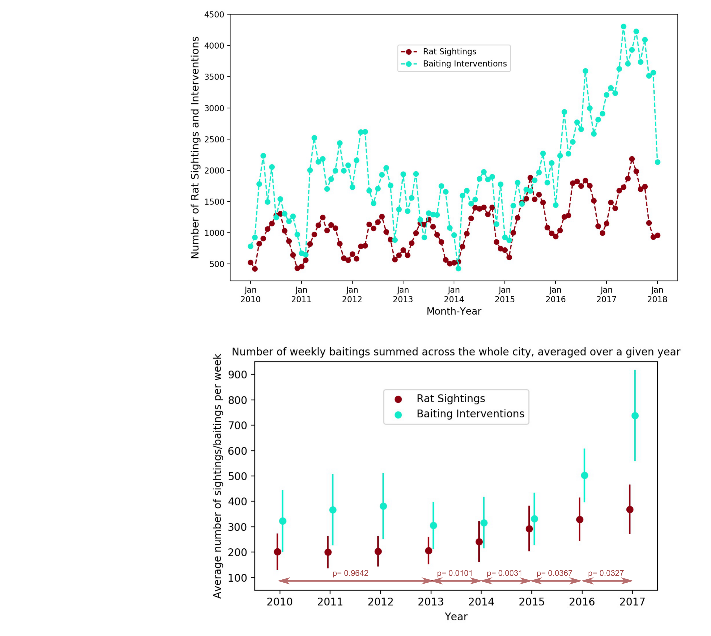

<H2>NYC Rat Sightings Project </H2>
 

Rats are a large problem in New York City. They present a health threat, can contaminate food, spread diseases and reduce quality of life. They can also damage utilities and contribute to the erosion of buildings’ structural integrity. In the last years the rat population in the city increased as New Yorkers logged more than 17,200 sightings in 2016, up from 12,600 in 2014. In an attempt to reduce the number of NYC rats mayor Bill de Blasio just last year declared to dedicate <a href="https://www.nytimes.com/2017/07/12/nyregion/new-york-city-rat-problem.html">$32 million </a> to fight the most problematic rat areas in the city.  
 
 
In my project I am exploring rat sightings across New York City reported via the 311 system. I have a dataset that contains reported rat sightings since 2010 until today (in total around 110 000 logged events) and a dataset that contains rodent interventions/inspections in the city, also since 2010 until today (in total around 1.3 million logged events). This totals to <b>around 380MB of data</b>. Both datasets (among other things) contain locations of a sighting or intervention, time of event and type.    
I am interested in exploring and understanding the dynamics of rat sightings across time and how they couple to intervention events. The ultimate goal of my project is: 
<b>(i)</b> to asses the <b>effect of rat interventions</b>, in particular the effect of increased interventions since 2016 
<b>(ii)</b> choose and <b>test different models</b> for this system (simple linear regression, k-Nearest Neighbors, Random Forest)  
<b>(iii)</b> make <b>predictions to inform how best to distribute future interventions</b> 
If needed I also plan to include weather data, socioeconomic data on individual NYC neighborhoods and if obtainable a New York City Department of Sanitation schedule or log of garbage collections, all of which I expect will improve my model.
  

Here is what I have extracted so far.  
<H3>1) Spatio-temporal animation of sightings and interventions in NYC</H3>

 I extracted intervention events where rodenticide was applied and rat sighting events and I created a spatio-temporal animation of these two as seen in the gif below. Each point in the animation corresponds to a rat sighting (in crimson) or a baiting intervention event (in aqua). The animation displays that while rat sightings occur across the city, they are distributed very non-uniformly. It also shows rich dynamics with oscillatory behavior and an overall increase of the number of events over the years which is even more visible in the plots in the next section.

<H3>2) Starting in 2013 the increase in the number of rat sightings is statistically significant</H3>

I plot the number of rat sightings and interventions as a function of time and determine whether the number of events is changing across the years.   
- <b>top plot</b>: number of rat sightings and interventions per month as a function of time, clearly demonstrates that the number of rat sightings (in crimson) oscillates and on average increases as does the number of interventions (in aqua) which shows a noticeable increase starting in 2016  
-  <b>bottom plot</b>: average number of rat sightings (in crimson) and interventions (in aqua) per week for a given year. I compared rat sightings in years 2010-2013 with one-way ANOVA and obtained p-value = 0.9642 as is denoted on the bottom plot. Thus the mean number of weekly rat sightings didn't change from 2010 to 2013. From 2013 on I compare weekly number of rat sightings in each year with the year prior by using two-sample t-tests. The p-values denoted in the bottom plot show that the increase of rat sightings per week in a given year compared to the year prior is statistically significant starting in 2013.

 <H3>3) As interventions begin to in increase 2016, the rate of growth of rat sightings is not exponential</H3>

As the average number of rat sightings per week has increased, the average number of rat baitings has increased as well, but only starting in 2016 when there were on average 51% more weekly baitings than the year before and in 2017 when there were 47% more baiting interventions per week than the year before. 
I then compared the slope of rat sightings increase bewteen consecutive years after 2013 and the results show that the slope does not change from one year to the next (slope = 41.3 std err = 3.6), from which I can conclude that from 2013 on the rate of growth has been constant. Which is not exponential growth in which case the increase in numbers would be proportional to the population size and the rate of change would not be constant - instead exponential growth has fixed percent increase at regular time intervals. Here is what I can conclude so far: 
The number of rat sightings began to increase in 2014 and in 2016 the City ramped up the number of rat interventions. What followed was that instead of observing the rate of growth of rat sightings curve up, the growth rate remains constant. So this "arrested" growth could be a consequence of the City coming up with more interventions, it does coincide with a large increase of interventions. But it could also have to do with other factors of course, like saturation of natural habitat, etc. 

 <H3>4) More rat sightings in a week = more baiting interventions in that week</H3>

When looking across the whole city, does the City respond to a week with more rat sightings with more baiting interventions that week? Indeed it does! 

 
- <b>left plot</b>: linear regression results suggest that when looking over the whole time span 2010-2018, the City's strategy has been that for every 100 additional rat sightings in a week, there are on average between 98 and 127 additional rat baiting interventions that week. And from the intercept estimate we can conclude that in absence of any rat sightings, the number of weekly baiting interventions would be on average somewhere between 81 and 161. 
  
- <b>right plot</b>: how (or if) this strategy has changed over the years, are the slopes equal if I compare 2014, 2015, 2016, 2017? I do a statistical comparison of regression lines, and my test shows that all estimated slopes for different years are not significantly different from one another. Next I show that change in intercept was not significant in 2015 compared to 2014 but there is a significant change in the estimated intercept in 2016 and again in 2017. So the City continues to respond to more sightings with more interventions and while it has increased the overall baseline response (the intercept increased in 2016 and in 2017, the two lines shifted up), the City did not also change the rate at which it increases the number of responses in a week if the number of sightings in that week increases (slopes are not different). 

<H3>5) More interventions in the neighbourhoods where there are more sightings</H3>

On the local level - is it the case that there are more interventions in the neighbourhoods where there are more sightings? Yes (on average)!

 
- <b>left plot</b>: linear regression model shows that the yearly total number of rat sightings for a given zipcode is correlated to the yearly total number of rat interventions at that zipcode (R^2 = 0.44) and the relation is significant (p-values 0.0000). So on average there are more interventions at locations where there are more rat sightings. On average in the period 2010-2017 a neighborhood "needs" at least around 7 rat sightings per year to start getting interventions. And on average in this time period a neighborhood with additional 100 rat sightings per year, has beween 189 and 215 additional interventions per year.
  
- <b>right plot</b>: zipcodes that deviate most from the linear regression fit - some are consistently above the regression line and some are consistently below. Some zipcodes have comparable numbers of sightings but siginificant diferences in the number of interventions.

<H3>6) Interventions score - Bronx : 5, Brooklyn : 1</H3>

One extreme difference: a couple Bronx zip codes (10456, 10457, 10458, 10468) around Fordham University on average have between 327 and 795 MORE rat interventions per year than predicted. On the other hand a few Brooklyn zip codes (11238, 11233, 11207,...) - part of Crown Heights, Bed-Stuy, South-East Brooklyn... on average have up to 400 FEWER rat interventions per year than predicted.  
In many of these Bronx and Brooklyn neighborhoods the numbers of rat sightings are comparable if not even indistinguishable (ANOVA comparison on a couple of these zipcodes showed that between some there are no sigificant differences in number of sightings), yet the number of interventions are on average 5 times higher in the Bronx zipcodes.  
The plot below shows each zipcode colored according to how much the number of interventions deviates from the linear fit prediction based on the number of rat sightings at that zipcode.  
It will be interesting to further investigate in what ways these neighborhoods are different to try to see if I can find any possible indication of what impact such a different level of interventions has.

  
Rat sightings dataset is found here: <a href="https://nycopendata.socrata.com/Social-Services/Rat-Sightings/3q43-55fe/data">Rat sightings</a> 
 

Rodent interventions/inspections dataset is found here: <a href="https://data.cityofnewyork.us/Health/Rodent-Inspection/p937-wjvj">Rodent interventions</a> 
