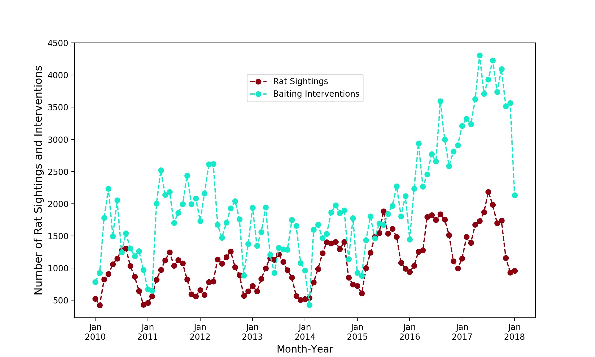

# DataIncubatorFeb2018

 

Total number of rat intervention events where rodenticide was applied and number of rat sighting events in each month. The number of rat sighting oscillates and on average increases as does the number of interventions which shows a noticeable increase after the middle of 2016.
 
