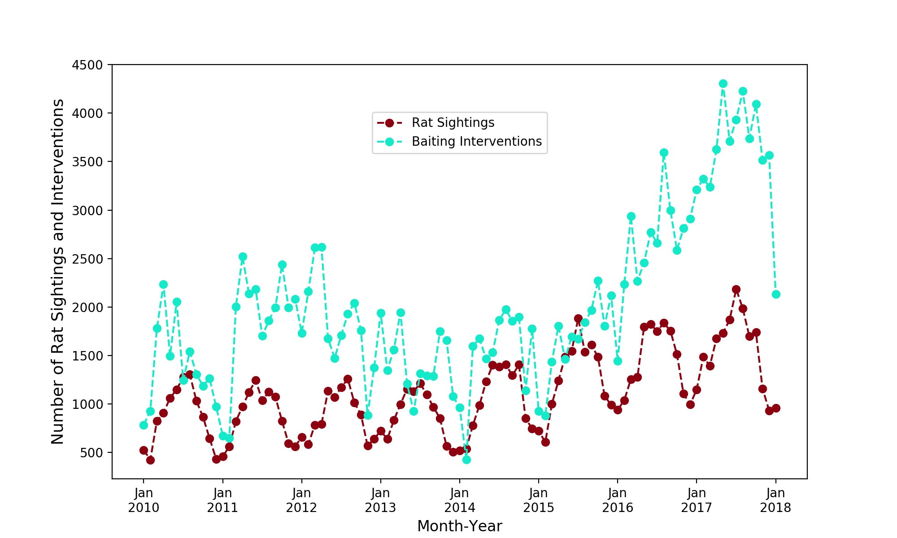

# DataIncubatorFeb2018
  
NYC Rat Sightings (Project Proposal from Ana Hocevar)
 

Rats are a large problem in New York City. They present a health threat, can contaminate food, spread diseases and reduce quality of life. They can also damage utilities and contribute to the erosion of buildings’ structural integrity. In the last years the rat population in the city increased as New Yorkers logged more than 17,200 sightings in 2016, up from 12,600 in 2014. In an attempt to reduce the number of NYC rats mayor Bill de Blasio just last year declared a <a href="https://www.nytimes.com/2017/07/12/nyregion/new-york-city-rat-problem.html">$32 million assault</a> on the most problematic rat strongholds in the city.  
 
In my project I will explore rat sightings across New York City reported via the 311 system. I found a dataset that contains reported rat sightings since 2010 until today (in total N logged events) and a dataset that contains rodent interventions/inspections in the city, also since 2010 until today (in total N logged events). Both dataset (among other things) contain locations of a sighting or intervention, time of event and type.  
I am interested in exploring and understanding the dynamics of rat sightings across time and how they couple to intervention events. The ultimate goal of the project is: 
(i) to asses the success of increased interventions since 2017 
(ii) make a model of this system using the two datasets  
(iii) make predictions and inform how best to distribute future interventions 
For better results I also plan to include weather data and if obtainable a New York City Department of Sanitation schedule or log of garbage collections.  
 
So far I extracted intervention events where rodenticide was applied and rat sighting events and I created an animation of these two as seen in the gif on the left. Each point in the animation coresponds to a rat sighting (in crimson) or an baiting intervention event (in aqua). The animation displays rich dynamics with oscillatory behavior and an overall increase of events. That is even more visible in the plot on the right which shows the total number of sightings and interventions each month. 
 

 
Rat sightings dataset is found here: <a href="https://nycopendata.socrata.com/Social-Services/Rat-Sightings/3q43-55fe/data">Rat sightings</a> 
 
Rodent interventions/inspections dataset is found here: <a href="https://data.cityofnewyork.us/Health/Rodent-Inspection/p937-wjvj">Rodent interventions</a> 
